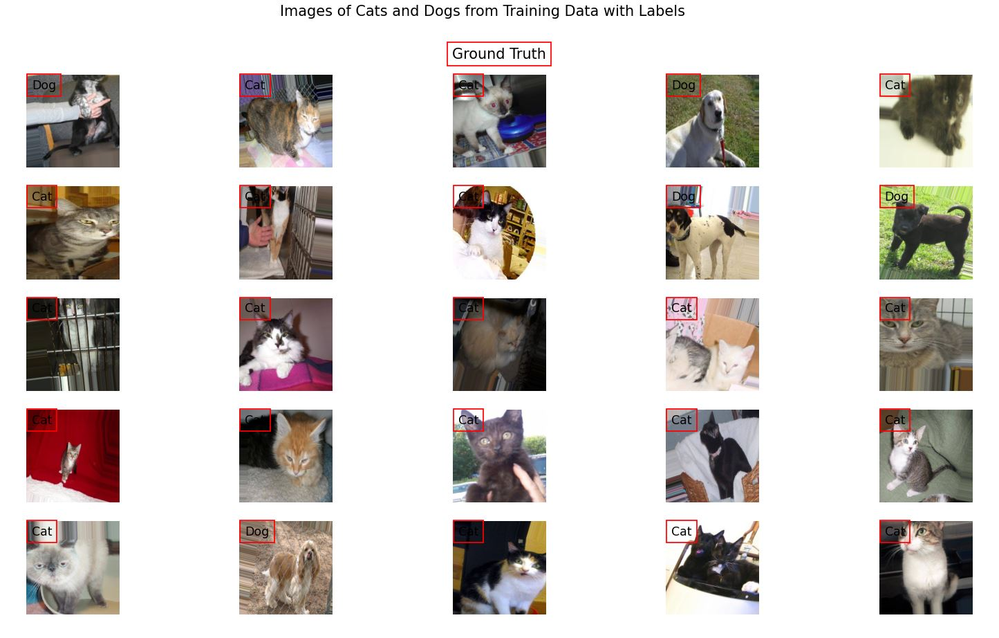
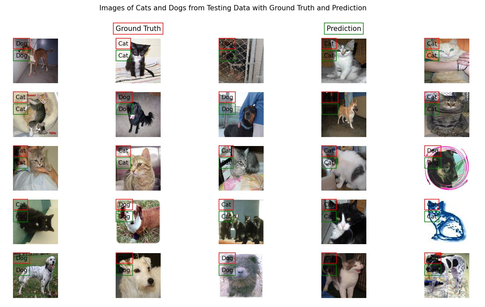

<h3>Cats and Dogs Kaggle</h3>
This code is targeted at one of the Kaggle competition that includes the Image Classification which 
aims to develop a model that can correctly classify two classes i.e. Cats vs. Dogs. 
https://www.kaggle.com/chetankv/dogs-cats-images   

Here I have implemented the Inception Network, specifically Inception v3, in order to classify the 
images. The dataset is divided into two categories: Train and Test. The dataset can be found at  
https://www.kaggle.com/chetankv/dogs-cats-images  

Dataset:
<ul>
  Training:
    <ul>
        <li>Cats : 4000</li>
        <li>Dogs : 4000</li>
    </ul>
</ul>
<ul>
  Test:
    <ul>
        <li>Cats : 1000</li>
        <li>Dogs : 1000</li>
    </ul>
</ul>

As seen from the code, the images were provided as an input to the Inception Network after some specific
transformations. The provided images can be seen here:

  

After the Model is trained, the results from the Test can be seen below. The accuracy of the Model was
92%.

  

